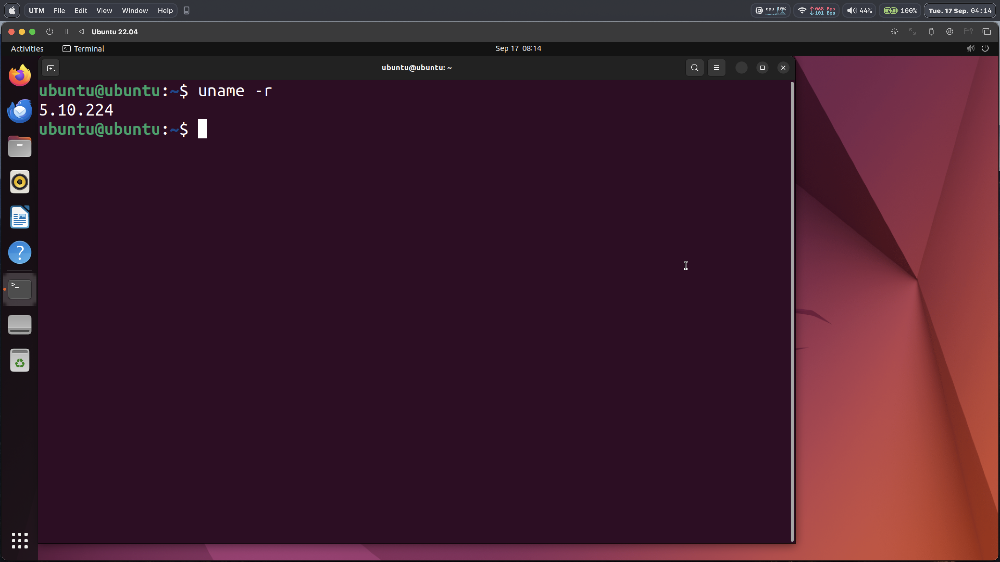
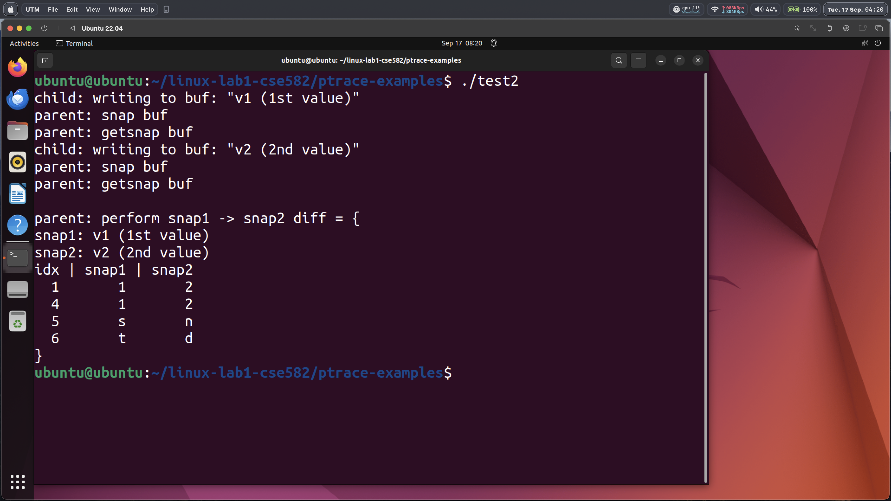

# 1.0 Kernel Setup
## The hardware and OS of your experiment machine
**Hardware**: Macbook Pro, 13-inch, 2020 (chip: Apple M1)  
**OS**: macOS 14.6.1 23G93 arm64 (kernel: 23.6.0)

## The command lines you used to setup and run the VM
I ran my linux instance on [UTM](https://mac.getutm.app/).
Unfortunately, UTM does not offer a way to create a new instance from shell.
Thus, some interaction with the UTM GUI will be necessary.

Run the following commands inside the parent machine.
```console
wget https://archive.org/download/ubuntu-20.04-arm64-utm/ubuntu-20.04-arm64-utm.zip
unzip ubuntu-20.04-arm64-utm.zip
# this will yield an "Ubuntu 22.04.utm" disk image.
```
Now open UTM. To create a new instance, click through: File > New... > Existing :: Open...
and choose "Ubuntu 22.04.utm" from the previous steps.

VM configuration:  
**RAM**: 8GB (8192MB)  
**Disk**: 64GB (default)  
**Number of cores**: 6

Click on the large arrow button to start the instance.

Run the following commands inside the VM.  
First, we have to resize the partition to use the full 64GB allocated to the VM
([source](https://www.albertyw.com/note/resizing-ubuntu-utm)).
```console
# bash
sudo fdisk -l
sudo parted -l
pvresize /dev/vda3

# enter lvm console
sudo lvm
lvextend -l +100%FREE /dev/ubuntu-vg/ubuntu-lv
exit

# bash
sudo resize2fs /dev/ubuntu-vg/ubuntu-lv
```

By default, the VM will run version 5.15.0-87-generic of the linux kernel.

Update GRUB_DEFAULT in /etc/default/grub to the following:
GRUB_DEFAULT="Advanced options for Ubuntu>Ubuntu, with Linux 5.10.224"
Run `sudo update-grub` to apply these changes.

```console
sudo apt-get update

sudo apt-get -y install libncurses5-dev gcc make git exuberant-ctags bc libssl-dev flex bison libelf-dev rsync pahole

wget https://cdn.kernel.org/pub/linux/kernel/v5.x/linux-5.10.224.tar.xz
tar xvf linux-5.10.224.tar.xz

cp /boot/config-`uname -r`* linux-5.10.224/.config

cd linux-5.10.224

scripts/config --disable SYSTEM_TRUSTED_KEYS
scripts/config --disable SYSTEM_REVOCATION_KEYS
scripts/config --disable SECURITY_LOCKDOWN_LSM
scripts/config --disable MODULE_SIG
scripts/config --disable MODULE_SIG_ALL

make -j$(nproc)
sudo make modules_install
sudo make install
sudo update-grub
sudo reboot
```

- A screenshot of the running VM showing that Linux kernel version


- The rough time you took to complete the setup  
12 hours

# 1.1 Understand ptrace
The ptrace syscall is implemented in `kernel/ptrace.c`.

## PTRACE_PEEKDATA:
1. Using ptrace_access_vm, reads a word from the tracee process's memory into a temporary kernel buffer (tmp).
2. Using put_user, copies the data from the kernel buffer to the user-provided address (data) using put_user.
3. Returns 0 on success or -EIO on failure.

## PTRACE_POKEDATA
1. Using ptrace_access_vm, writes a word (data) to the tracee's memory.
2. Returns 0 on success or -EIO on failure.

# 1.2 Implement Selective Memory Snapshotting
Changes were made to four kernel files:
- include/linux/ptrace.h
- include/uapi/linux/ptrace.h
- kernel/ptrace.c
- include/linux/sched.h

## i/l/ptrace.h
```c
struct ptrace_snapshot {
	unsigned long addr;
	unsigned int size;
	void *data;
};

struct ptrace_snapshot_ctx {
	struct ptrace_snapshot *snapshots;
	unsigned int snapshots_len;
	unsigned int num_active_snapshots;
	unsigned int total_snapshot_size;
};
```

- Defined `struct ptrace_snapshot` (to represent a single snapshot) and `struct ptrace_snapshot_ctx` (to manage all snapshots belonging to a tracee, which are stored in the exponentially-resized `snapshots` array)
- Modified `ptrace_init_task()` and `ptrace_release_task()` to respectively initialize and free a tracee's ptrace_snapshot_ctx field


## i/u/l/ptrace.h
```c
#define PTRACE_SNAPSHOT		  10
#define PTRACE_RESTORE		  11
#define PTRACE_GETSNAPSHOT	  12

struct psnap_mem_region {
	unsigned long addr;
	unsigned int size;
};
```
- Goal: change uapi to expose new functionalities to users
- Defined constants `PTRACE_SNAPSHOT`, `PTRACE_RESTORE, `PTRACE_GETSNAPSHOT` for new commands in the syscall interface
- Defined `struct psnap_mem_region` to allow users to specify the memory region to snapshot

## k/ptrace.c
- Implemented snapshot, restore, and getsnapshot in new `generic_ptrace_X()` functions, which behave as described in the instructions
- Updated `ptrace_request()` to dispatch new commands to corresponding `generic_ptrace_X()` functions

## i/l/sched.h
- Added `struct ptrace_snapshot_ctx` field to the `struct task_struct` to manage all ptrace snapshots associated with the process. Null-initialized by `ptrace_init_task()` upon process creation; freed upon exit.


# 1.3 Test Selective Memory Snapshotting
## linux-lab1-cse582/ptrace-examples/test1.c


## linux-lab1-cse582/ptrace-examples/test2.c



Both test programs behave as expected.

