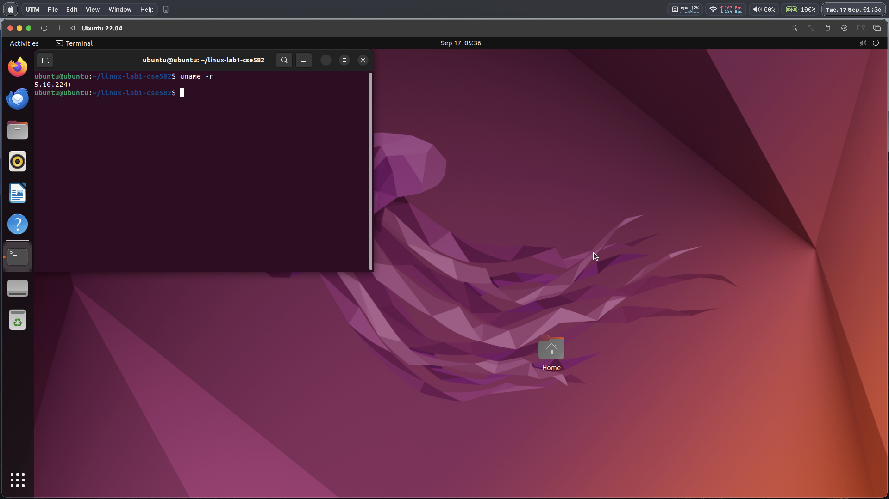

# 1.0 Kernel Setup
## The hardware and OS of your experiment machine
Hardware: Macbook Pro, 13-inch, 2020 (chip: Apple M1)  
OS: macOS 14.6.1 23G93 arm64 (kernel: 23.6.0)

## The command lines you used to setup and run the VM
I ran my linux instance on [UTM](https://mac.getutm.app/).
Unfortunately, UTM does not offer a way to create a new instance from shell.
Thus, some interaction with the UTM GUI will be necessary.

Run the following commands inside the parent machine.
```console
wget https://archive.org/download/ubuntu-20.04-arm64-utm/ubuntu-20.04-arm64-utm.zip
unzip ubuntu-20.04-arm64-utm.zip
# this will yield an "Ubuntu 22.04.utm" disk image.
```
Now open UTM. To create a new instance, click through: File > New... > Existing :: Open... 
and choose "Ubuntu 22.04.utm" from the previous steps.

VM configuration:  
RAM: 8GB (8192MB)  
Disk: 64GB (default)  
Number of cores: 6  

Click on the large arrow button to start the instance.

Run the following commands inside the VM.
First, we have to resize the partition to use the full 64GB allocated to the VM
([source](https://www.albertyw.com/note/resizing-ubuntu-utm)).
```console
# bash
sudo fdisk -l
sudo parted -l
pvresize /dev/vda3

sudo lvm
# lvm console
lvextend -l +100%FREE /dev/ubuntu-vg/ubuntu-lv
exit

# bash
sudo resize2fs /dev/ubuntu-vg/ubuntu-lv
```

By default, the VM will run version 5.15.0-87-generic of the linux kernel.
The following steps install my custom linux kernel into the VM.

Update GRUB_DEFAULT in /etc/default/grub to the following:
GRUB_DEFAULT="Advanced options for Ubuntu>Ubuntu, with Linux 5.10.224+"

```console
sudo apt-get update

sudo apt-get install libncurses5-dev gcc make git exuberant-ctags bc libssl-dev flex bison libelf-dev rsync pahole ccache

git clone https://github.com/Justin08784/linux-lab1-cse582.git
cp /boot/config-`uname -r`* linux-lab1-cse582/.config
cd linux-lab1-cse582
git checkout main

scripts/config --disable SYSTEM_TRUSTED_KEYS
scripts/config --disable SYSTEM_REVOCATION_KEYS
scripts/config --disable SECURITY_LOCKDOWN_LSM
scripts/config --disable MODULE_SIG
scripts/config --disable MODULE_SIG_ALL

# build script
chmod +x ./build.sh
sudo ./build.sh

sudo reboot
```

- A screenshot of the running VM showing that Linux kernel version


- The rough time you took to complete the setup


